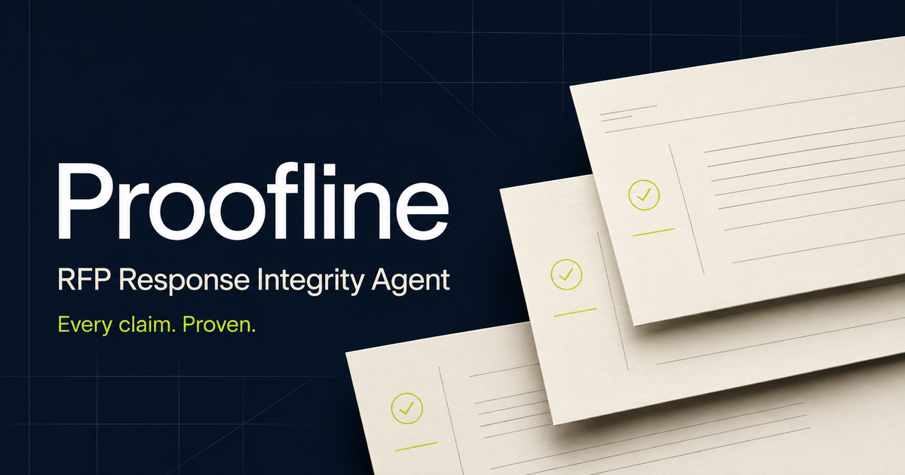

# Proofline — RFP Response Integrity Agent

[Live interactive demo](https://proofline-rfp.ch4.chatgpt.site) · Built by [Chitransha Mishra](https://github.com/chitransha26)

> Catch the claim your RFP copilot would confidently submit.

Proofline is a working AI MVP for pre-submission response integrity. It accepts a completed RFP response and its supporting evidence, decomposes buyer-facing commitments into atomic claims, verifies support and scope, quotes the governing evidence, and proposes safe language before submission.

## Why this product

Most AI RFP tools optimize first-draft speed. Proofline addresses a different risk: a fluent, cited answer can still be wrong for the proposed entity, product tier, deployment model, territory, contract, or effective date.

Proofline treats every response as a set of atomic commercial claims. Each claim receives an inspectable admissibility decision and retains the exact evidence span, applicable scope, accountable authority, and policy version used to reach it.



It is intentionally not another “upload a document and generate prose” demo. The product models the defensible chain from requirement to evidence to atomic claim to human approval to export.

## Working MVP workflow

1. Upload one completed RFP response in PDF, Word, Excel, CSV, or text format.
2. Add the policies, contracts, security documents, and approvals that should support it.
3. Run a live OpenAI Responses API analysis with structured output.
4. Review atomic claims as Admissible, Qualify, Approval required, or Blocked.
5. Inspect verbatim evidence quotes, source locations, scope findings, and accountable owners.
6. Export the audit-ready claim ledger as CSV.

The public portfolio deployment supports bring-your-own OpenAI API key. The key and uploaded files are used only for the analysis request and are not persisted by Proofline. A planted-risk Northstar sample is included so the full workflow can be tested without company documents.

## Deliberately planted integrity traps

- Expired SOC 2 evidence
- Conflicting 30-day and 90-day retention policies
- SSO available only on the Enterprise plan
- Incomplete cross-border processing evidence across the United States, Canada, and Mexico
- Missing accessibility applicability determination
- Insurance evidence with incomplete territorial and currency scope
- Customer-specific 99.99% SLA presented beside the standard 99.9% SLA
- Five requirements embedded in one question
- A later RFP amendment changing the deadline
- An indirect prompt injection hidden in an appendix

## Claim-admissibility model

Proofline does not present an opaque model-generated confidence percentage. It assigns inspectable, claim-level decisions:

- **Admissible** — the precise statement is grounded in current evidence for the response context.
- **Qualify** — evidence supports a narrower statement, which Proofline proposes explicitly.
- **Approval required** — applicability or a commercial exception belongs to a named authority.
- **Blocked** — the proposed claim is unsupported, expired, prohibited, or wrong-scope.

Negative assurance is intentional: Proofline exports its audit manifest but does not label a response submission-ready while material gate conditions remain.

## North American applicability model

Proofline separates core evidence from configurable applicability profiles:

- United States federal requirements plus the applicable states and territories
- Canadian federal requirements plus the applicable provinces and territories
- Mexican federal requirements
- Cross-border processing, subprocessors, transfer safeguards, currencies, governing law, and territorial scope
- Optional sector overlays for regulated industries and public procurement

The default demo uses a North America profile with no sector overlay. Proofline measures requirement and evidence coverage; it does not represent that software can make a legal-compliance determination. Questions of legal applicability are routed to counsel or the designated procurement owner.

## Evaluation metrics for a production implementation

- Requirement extraction recall
- Atomic sub-requirement coverage
- Evidence precision and scope correctness
- Unsupported-claim detection precision and recall
- Wrong-scope detection across entity, product, deployment, territory, contract, and date
- Conflict-detection precision and recall
- Correct abstention and false-block rates
- SME-routing accuracy
- Spreadsheet round-trip fidelity
- Submission-gate recall and reproducibility
- Time to approved draft

## MVP architecture

- Browser-based multi-file intake with explicit response and evidence roles
- Server-side OpenAI Responses API call; API keys are never shipped in client code
- Native file inputs for PDF, DOCX, XLSX, CSV, and text evidence
- Strict JSON Schema output for reproducible rendering and export
- Prompt-injection boundary that treats every uploaded document as untrusted data
- No application persistence in the public MVP

A production implementation would add authenticated tenant isolation, permission-aware retrieval, durable evidence libraries, deterministic policy gates, immutable audit events, evaluation harnesses, rate limiting, and format-preserving Word/Excel round trips.

## Local development

```bash
npm install
npm run dev
```

Build for production with `npm run build`.

Set `OPENAI_API_KEY` for a host-funded deployment or enter a key in the public MVP. `OPENAI_MODEL` defaults to `gpt-5.4-mini`.
